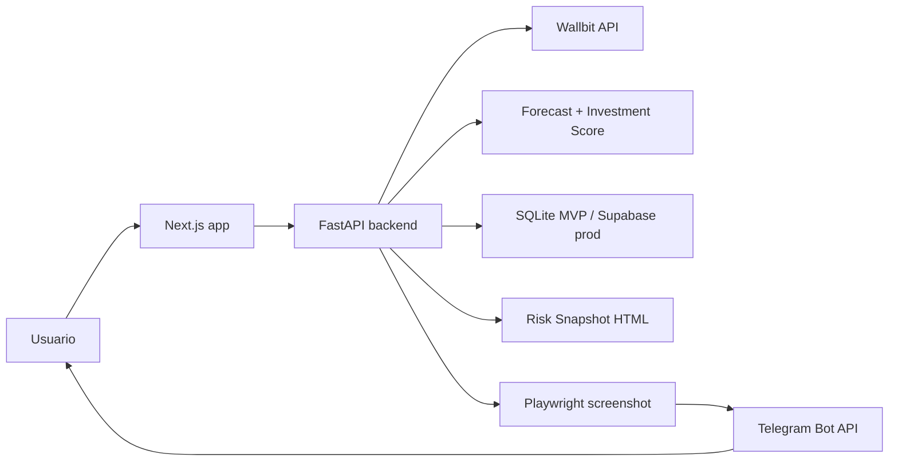

# Wallbit Pulse AI - MVP Blueprint

## 1. Arquitectura tecnica

Wallbit Pulse AI se divide en dos superficies: una web app minimalista para configurar, simular y revisar el pulso financiero; y un backend FastAPI que orquesta Wallbit, ML, alertas, reportes HTML, screenshots y Telegram.



Principios:

- Frontend: Next.js App Router, TypeScript, Tailwind CSS, shadcn/ui, lucide-react, Recharts solo cuando aporte claridad.
- Backend: FastAPI, httpx, numpy/pandas, Playwright, jobs simples con APScheduler.
- MVP local: datos demo si no existe API key real.
- Seguridad: API key cifrada, modo read-only por defecto, trades solo con confirmacion humana.
- Reporting: cada alerta importante genera una pagina HTML capturable en `/report/risk-alert/{alert_id}`.

## 2. Flujo de usuario

1. Abre landing y entiende la promesa: radar predictivo conectado a Wallbit.
2. Conecta API Key o entra en modo demo.
3. Mantiene el modo solo lectura activado.
4. Vincula Telegram con un codigo corto.
5. Ve el Home/Pulse con cuatro cards.
6. Simula una inversion con activo, monto, horizonte y perfil.
7. Crea una alerta sencilla en lenguaje natural.
8. El backend detecta una condicion de riesgo.
9. Se genera un Risk Snapshot HTML.
10. Playwright captura PNG.
11. Telegram recibe texto + imagen.
12. Si se prepara un trade, el usuario escribe `CONFIRMAR`; si no, no se ejecuta nada.

## 3. Modelo de datos

- `users`: id, email, created_at.
- `wallbit_connections`: id, user_id, encrypted_api_key, mode, permissions, created_at.
- `telegram_links`: id, user_id, telegram_chat_id, telegram_username, linked_at.
- `watched_assets`: id, user_id, symbol, enabled, created_at.
- `portfolio_snapshots`: id, user_id, total_value, checking_balance, investment_balance, snapshot_json, created_at.
- `forecasts`: id, user_id, symbol, amount, horizon_days, bearish_pnl, base_pnl, bullish_pnl, risk, explanation, created_at.
- `recommendations`: id, user_id, symbol, score, label, reason, created_at.
- `alerts`: id, user_id, symbol, alert_type, severity, message, snapshot_url, screenshot_path, sent_to_telegram, created_at.
- `trade_confirmations`: id, user_id, symbol, side, amount, status, confirmation_text, created_at.
- `audit_logs`: id, user_id, event_type, payload_json, created_at.

## 4. Roadmap de 7 dias

Dia 1: UX final, datos demo, rutas principales y branding minimalista.  
Dia 2: Dashboard Pulse, Connect Wallbit, Connect Telegram y estado demo.  
Dia 3: Forecast Monte Carlo, Investment Score y ranking maximo de 5 activos.  
Dia 4: Backend FastAPI, Wallbit mock/client, endpoints y contratos TypeScript.  
Dia 5: Risk Snapshot HTML, Playwright screenshot y Telegram sendPhoto.  
Dia 6: Alert engine, comandos del bot y trade confirmation con audit log.  
Dia 7: QA, demo script de 2 minutos, polish visual, README y pitch.

## 5. Diseno de pantallas

- Landing: hero centrado, mock de alerta Telegram, tres beneficios y disclaimer.
- Connect Wallbit: API key, modo solo lectura, validacion demo, mensajes de seguridad.
- Connect Telegram: codigo de vinculacion, preview de alerta y comandos principales.
- Pulse: cuatro cards solamente: valor, alerta, oportunidad y riesgo.
- Forecast: una decision: cuanto podria ganar o perder bajo tres escenarios.
- Radar: cinco activos priorizados en cards, sin tabla grande.
- Alerts: builder tipo frase: "Cuando NVDA caiga mas de 5%, enviar Telegram".
- Risk Snapshot: card oscura capturable, sin navegacion ni sidebar.
- Telegram Preview: mensaje + snapshot como se enviaria al usuario.
- Trade Confirmation: modal con datos, riesgo, escenarios, disclaimer y escritura `CONFIRMAR`.

## 6. Componentes frontend

- `MinimalHeader`
- `ConnectWallbitCard`
- `TelegramConnectCard`
- `PulseSummaryCard`
- `MainAlertCard`
- `OpportunityCard`
- `RiskLevelCard`
- `ForecastSimulator`
- `ScenarioCards`
- `InvestmentRanking`
- `TelegramPreview`
- `RiskSnapshotCard`
- `TradeConfirmationModal`
- `DisclaimerBanner`

## 7. Endpoints backend

- `POST /connect-wallbit`
- `GET /dashboard`
- `POST /forecast`
- `GET /ranking`
- `POST /alerts`
- `GET /alerts`
- `POST /telegram/webhook`
- `POST /reports/risk-snapshot`
- `GET /report/risk-alert/{alert_id}`
- `POST /reports/{alert_id}/send-telegram`
- `POST /trade/prepare`
- `POST /trade/confirm`

## 8. Pseudocodigo ML

```python
prices = load_history(symbol)
features = build_features(prices, exposure, cash, risk_profile)

trend_score = scale(rolling_mean_30)
momentum_score = scale(momentum_30)
volume_score = scale(volume_change)
risk_adjusted_return_score = scale(mean_return / volatility)
drawdown_opportunity_score = scale(abs(max_drawdown))
exposure_penalty = scale(exposure_percent)

investment_score = (
    0.25 * trend_score
    + 0.20 * momentum_score
    + 0.15 * volume_score
    + 0.20 * risk_adjusted_return_score
    + 0.10 * drawdown_opportunity_score
    - 0.10 * exposure_penalty
)

simulations = monte_carlo(mean_daily_return, daily_volatility, horizon_days, runs=1000)
p10, p50, p90 = percentile(simulations, [10, 50, 90])
pnl = amount * (price_scenario / current_price - 1)
```

## 9. Pseudocodigo Telegram

```python
if command == "/start":
    send_message(chat_id, welcome)
elif command == "/resumen":
    dashboard = get_dashboard(user)
    send_message(chat_id, format_summary(dashboard))
elif command.startswith("/forecast"):
    symbol, amount, days = parse_args(command)
    forecast = forecast_service.run(symbol, amount, days)
    snapshot = report_service.create_forecast_snapshot(forecast)
    image = screenshot_service.capture(snapshot.url)
    send_photo(chat_id, image, caption=format_forecast(forecast))
elif command == "/rebalancear":
    send_message(chat_id, "Sugerencia: reducir NVDA de 18% a 12% y mover 6% a SPY.")
```

## 10. Pseudocodigo screenshot service

```python
async def capture_report(url, output_path):
    browser = await chromium.launch(headless=True)
    page = await browser.new_page(
        viewport={"width": 1200, "height": 800},
        device_scale_factor=2,
    )
    await page.goto(url, wait_until="networkidle")
    await page.screenshot(path=output_path, full_page=True)
    await browser.close()
    return output_path
```

## 11. Estrategia de demo

1. Landing: explicar que no es dashboard de mercado, es radar personal.
2. Conectar Wallbit: modo demo/read-only.
3. Vincular Telegram: mostrar codigo y preview.
4. Pulse: cuatro cards, NVDA requiere atencion.
5. Forecast: BTC, USD 500, 30 dias.
6. Enviar a Telegram: mostrar texto + imagen.
7. Alertas: crear "Cuando NVDA caiga mas de 5%, enviar Telegram".
8. Risk Snapshot: abrir HTML capturable.
9. Bot: mostrar `/rebalancear`.
10. Trade modal: escribir algo distinto a `CONFIRMAR` o cancelar para probar seguridad.

## 12. Pitch final de 90 segundos

Hoy muchos usuarios invierten mirando precios, graficos y noticias, pero siguen sin recibir una respuesta simple: que esta pasando con mi portafolio y que riesgo debo mirar ahora. Wallbit Pulse AI convierte la API de Wallbit en un radar predictivo personal. Conectas tu cuenta en modo solo lectura, vinculas Telegram y el sistema calcula tu pulso financiero: valor del portafolio, alerta principal, mejor oportunidad y nivel de riesgo. Luego puedes simular escenarios a 7, 15 o 30 dias con Monte Carlo para entender cuanto podrias ganar o perder bajo escenarios pesimista, base y optimista. Si ocurre una alerta relevante, como una caida fuerte en NVDA con alta exposicion, el backend genera un reporte HTML, lo captura como imagen con Playwright y te lo envia automaticamente por Telegram. No prometemos adivinar el mercado ni ganancias garantizadas. Simulamos escenarios, medimos riesgo y damos senales accionables. Y si el usuario decide operar, Wallbit Pulse AI solo prepara la orden: nunca ejecuta dinero sin confirmacion humana explicita.
